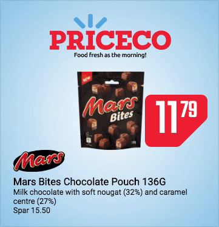

# Banner template
> A great starting point for building product based display banners.



## Table of content
- [Dependencies](#dependencies)
- [Install](#install)
- [Usage](#usage)
    - [`npm run watch`](#npm-run-watch)
    - [`npm run prod`](#npm-run-prod)
    - [Quick tip](#quick-tip)
- [Extracted style](#extracted-style)
- [Publish to Adapt Retail](#publish)


<a href="dependencies"></a>
## Dependencies

This project is using a various different dependencies to make it easier to make display banners.

- [ Adapt style ](https://github.com/AdaptRetail/banner-style)
    - [sass-asset-inline](https://github.com/LasseHaslev/sass-asset-inliner)
- [ Adapt Data ](https://github.com/AdaptRetail/banner-data)
- [laravel-mix](https://github.com/JeffreyWay/laravel-mix)
    - [ Laravel mix extender ](https://github.com/AdaptRetail/adapt-mix-extender)

<a href="install"></a>
## Install

```bash
# Clone repository
git clone https://github.com/AdaptRetail/banner-template

# Go to directory
cd banner-template

# Install dependencies
npm install 
```

<a href="usage"></a>
## Usage

<a href="npm-run-watch"></a>
### `npm run watch`
You can see the banner when working on it simply by writing `npm run watch`.
This will start [Browser Sync](https://www.browsersync.io/) and will display your content, and refresh your browsers every time you save a file.

If you want to test your banners on different devices you can see in the terminal after you entered the command.
There will be a `External` info with a `ip-address`. 
Copy paste that info into your browser on your external devices and watch the magic happens.

> Note: All the external devices must be on the same local network as your development machine.

<a href="npm-run-prod"></a>
### `npm run prod`
The `npm run prod` command is minifying css and javascript and removes source maps.
<!-- The prod command will also change `AdaptData` to `LightAdaptData`. -->

<a href="quick-tip"></a>
### Quick tip

To temporary remove all items to design for your products, you can add following line after we are setting the items.
F.eks. line `97` in the `main.js` file.

This overwrites the items array to only include the first item.

```js
items = [items[0]];
```

<a href="extracted-style"></a>
## Extracted style

Some of the style of this template has been extracted [to another git repository](https://github.com/AdaptRetail/priceco-style).
This is to reuse the elements and components in other productions.

This is a recommendation if you are creating multiple templates for [Adapt Retail](https://adaptretail.com).

<a href="publish"></a>
## Publishing to [Adapt Retail](https://adaptretail.com)

1. [Log in to your Adapt retail account](https://app.adaptretail.com/signup_login.php?task=login)
1. Click on template section in your left navigation bar
1. Create a new `Banner template`
1. Set your properties in `Details` tab
1. Select `Files` tab
1. Prepare files to [Adapt Retail](https://adaptretail.com) by running `npm run prod` in your terminal.
1. Drag `dist/ad.js` and `dist/ad.css` to the `dropzone (Drop files or click to upload)` in Adapt
1. **And you are done!**
